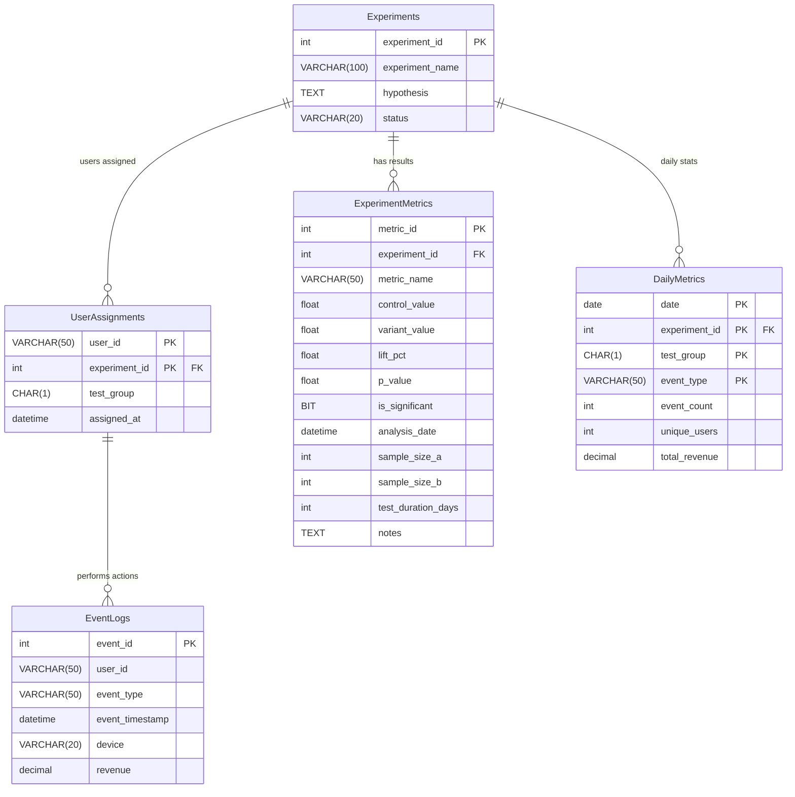
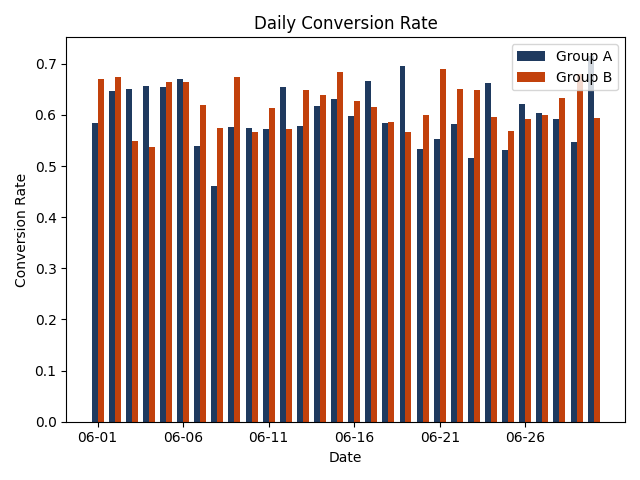
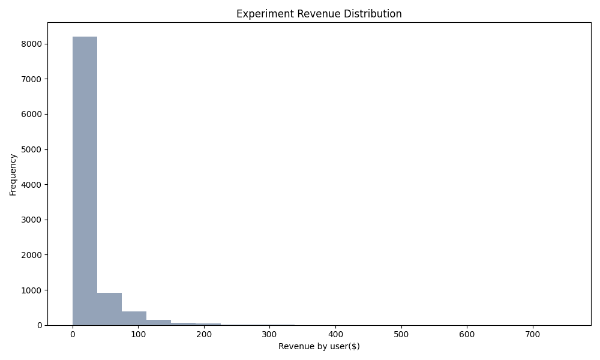

# E-commerce A/B test

## Project Description
An E-commerce store wants to add a new Payment Service Provider. The team wants to implement buttons for Apple Pay and Google Pay at the top of the final payment step. With the help of an A/B test, the team checks the efficiency of the implementation.

## Core Stack
- **Python 3.11+** - Main development language
- **MS SQL Server Express** - Data storage and aggregation
- **Power BI** - Reporting and visualization

### Python Libraries
- `pandas` - Data manipulation and analysis
- `numpy` - Numerical computations
- `scipy` - Statistical tests (z-test, chi-square, Mann-Whitney)
- `sqlalchemy` - Database connectivity and ORM
- `faker` - Synthetic data generation
- `matplotlib` - Data visualization
- `configparser` - Configuration management
- `pyodbc` - SQL Server driver (ODBC Driver 17 for SQL Server)
- `logging` - File and console logging


<details>
  <summary>Database Entity Relationship Diagram</summary>


</details>

## Workflow
### 1. Choose metrics and fix hypothesis
*   Conversion Rate (CR):

$$ CR = \frac{\text{Unique users with purchase}}{\text{Unique users with checkout}} $$

*   ARPU (Average Revenue Per User):

$$ \text{ARPU} = \frac{\text{Total revenue}}{\text{Unique users with view}} $$


I choose CR as the Primary Metric with a 5% MDE because it is more sensitive to the UX changes of a new payment gateway. I kept ARPU as a Secondary Metric with a 10% MDE to ensure that while I increased conversion, I didn't accidentally lower the total order value.

### 2. Choose randomization method and samples parameters
Users were split 50-50 randomly.

### 3. Fix the sample size

The sample size $n$ for each group is calculated using the standard formula for comparing means/proportions:

$$ n = \frac{2\sigma^2(Z_{\alpha/2} + Z_{\beta})^2}{\delta^2} $$

Where:
*   $\alpha$: Significance level (probability of Type I error)
*   $\beta$: Probability of Type II error ($1 - \text{Power}$)
*   $\delta$: Minimum Detectable Effect (MDE)
*   $\sigma^2$: Mean monthly variance of the metric in history


**Calculated Sample Parameters (`assets/metrics_stats.csv`):**

| Metric | History Mean | History Var | MDE | Sample Size | Duration (Months) |
| :--- | :--- | :--- | :--- | :--- | :--- |
| ARPU | 17.20 | 1494.77 | 1.72 | 7934 | 1.63 |
| CR | 0.67 | 0.22 | 0.03 | 3152 | 0.65 |

I decided to run the experiment for 1 months to collect enough data for primary metric.
Implementation of the formula in Python can be found in the script (`scripts/fix_sample_size.py`).

### 4. Start the experiment and collect 
Implementation of the basic data analysis you can find in the script (`scripts/collect_experiment_data.py`).

**Experiment Statistics (`assets/experiment_basic_data.csv`):**

| Group | View count| Add to basket count | Checkout count | Purchase count | CR | ARPU |
| :--- | :--- | :--- | :--- | :--- | :--- | :--- |
| A | 4855 | 3590 | 2253 | 1480 | 0.66 | 16.20 |
| B | 4935 | 3719 | 2349 | 1618 | 0.69 | 17.88 |

**Daily CR and Revenue distribution:**

 


### 5. Validate the experiment
Implementation of the basic data validation is in the script (`scripts/validate_experiment.py`).
#### 5.1. Sample Ratio Mismatch (SRM)
Sample Ratio Mismatch (SRM) indicates that the observed sample ratio differs significantly from the expected 50:50 split. This often points to data quality issues or bugs in assignment. I used the Chi-Square Goodness of Fit test.

```text
No SRM Detected.
P-value for Chi-Square Goodness of Fit is 0.44
```

#### 5.3. A/A Tests
A/A tests were performed on historical data to ensure the splitting mechanism is unbiased for both CR and Revenue. For CR I user classical two-proportion Z-test, for Revenue I used Mann-Whitney U-test.

```text
A/A test for CR passed.
Can't reject null-hypothesis as P-value for CR test 0.79.
Samples A and B on history data do not represent significantly difference.

A/A test for revenue passed.
Can't reject null-hypothesis as P-value for ARPU test 0.42.
Samples A and B on history data do not represent significantly difference.
```

### 6. Analyse the experiment data and make the decision
Implementation of the experiment analysis is in the script (`scripts/analyse_experiment_data.py`).
#### 6.1. A/B test for CR
I used the two-proportion Z-test:

$$ Z = \frac{p_B - p_A}{\sqrt{\frac{p_A(1-p_A)}{n_A} + \frac{p_B(1-p_B)}{n_B}}} $$

Where p_A and p_B are the conversion rates for groups A and B, and n_A and n_B are the number of users in each group.

#### 6.2. A/B test for ARPU
I used the Mann-Whitney U-test to compare the revenue distributions. This non-parametric test is chosen because revenue data is typically non-normal and skewed (as seen in the histogram), making standard t-tests unreliable. It assesses whether the distribution of the test group is stochastically different from the control group without assuming a normal distribution.

```text
A/B test for CR passed.
Can reject null-hypothesis as P-value for CR test 0.00076.
Samples A and B represent significantly difference.
Saved CR results to ExperimentMetrics.

A/B test for revenue passed.
Can reject null-hypothesis as P-value for ARPU test 0.01.
Samples A and B on history data represent significantly difference.
Saved ARPU results to ExperimentMetrics.
```

### 7. Results in Power BI
The results of the experiment are visualized in Power BI. The dashboard includes key metrics such as conversion rate, revenue, and user counts for both groups.

Daily Experiment Analysis
 
 

 Experiment Results at the last day of the experiment

 
  
 

## Conclusion
Based on the statistical analysis: 
+ Conversion Rate: The test group (B) showed a statistically significant improvement in conversion rate compared to the control group (A). 
+ ARPU: The Average Revenue Per User also showed a statistically significant increase. 

Decision: The introduction of Apple Pay and Google Pay buttons has positively impacted both conversion and revenue. It is recommended to roll out the new payment provider to 100% of users.